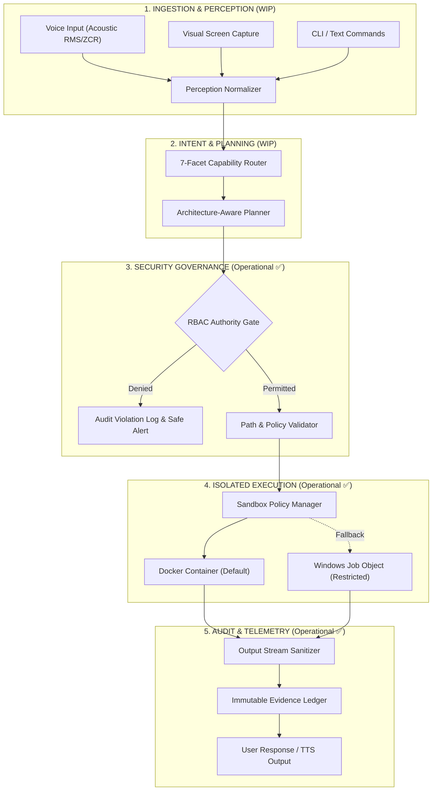
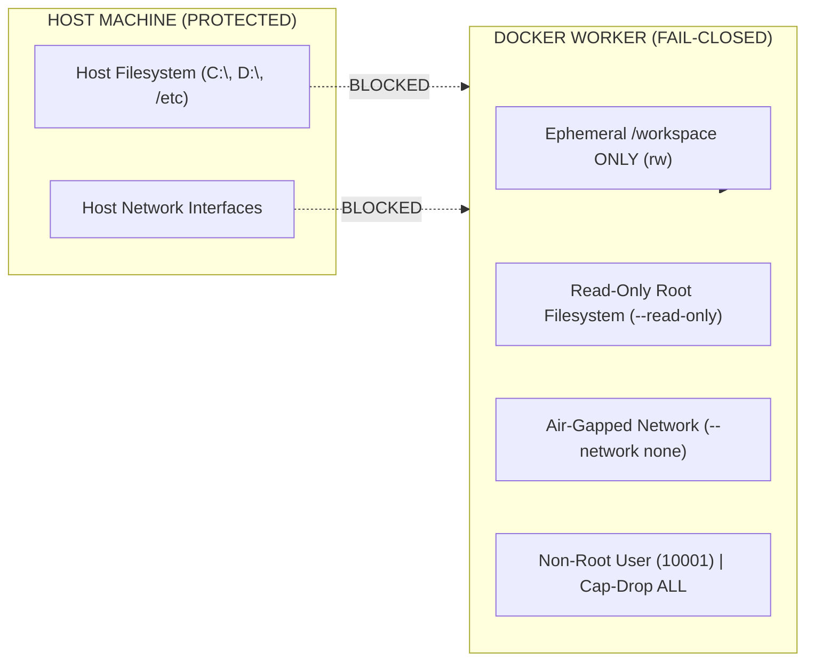

# 🤖 NOVA — Autonomous Multimodal AI Desktop Assistant & Agentic System
### *Public Architecture Showcase, Engineering Specifications & Active R&D Progress*

<p align="center">
  
  
  
  
  
  
</p>

---

> [!NOTE]
> **Honest Engineering & Project Status Disclaimer**:  
> **NOVA is currently an active, work-in-progress (WIP) personal research & development project.**  
> It is **NOT** a finished commercial product yet. While core security sandboxes, authorization gates, and modular pipelines have been built and rigorously verified through **725+ passing automated tests**, the end-to-end autonomous user workflows and live multi-modal conversational loops are still actively evolving and being built day-by-day.  
> 
> *The core experimental engine, internal automation scripts, and private keys remain in a private development repository to protect ongoing work. This repository publicly documents the architectural design, security mechanisms, and current verified milestones.*

---

## 📌 Project Overview & Vision

**NOVA** is a personal engineering initiative aimed at creating an autonomous desktop AI assistant tailored for local execution, strong security boundaries, and zero ongoing cloud API dependencies.

The core motivation is to move away from fragile, un-sandboxed script automation and build an AI assistant with **enterprise software engineering discipline**:
* Strict containerized execution (preventing untrusted scripts from harming the host machine).
* Explicit authorization gates (Role-Based Access Control before modifying files or executing commands).
* Test-driven development (validating logic with automated unit and integration tests rather than manual trial-and-error).

---

## 🚦 Current Implementation Status & Roadmap

To remain completely transparent about what is already operational versus what is actively being built:

| Subsystem / Feature | Current Status | Verification Method |
| :--- | :---: | :--- |
| **Fail-Closed Docker Sandbox** | ✅ **Operational** | Ephemeral `/workspace`, read-only rootfs, non-root user, automated pytest suite. |
| **RBAC Authorization & Path Safety** | ✅ **Operational** | Traversal protection (`Path.resolve`), sole authority gate verified by tests. |
| **AST Code Indexer & Patch Engine** | ✅ **Operational** | AST symbol extraction, unified diffs, and surgical line replacements verified. |
| **Automated Test Suite (725+ Tests)** | ✅ **Operational** | 100% green test suite run on Python 3.12 via Pytest. |
| **Database Migrations & Relational Schema** | ✅ **Operational** | Alembic migration chains for user profiles, audit logs, and memory sessions. |
| **Local 14B Inference Setup** | 🚧 **In Progress** | Qwen 14B QLoRA offloading targeted for local NVIDIA RTX 5050 Laptop GPU. |
| **End-to-End Dynamic Voice Loop** | 🚧 **In Progress** | Audio ingestion & acoustic validation built; continuous live conversational flow tuning underway. |
| **Autonomous Multi-Step Desktop Automation** | 🚧 **In Progress** | Atomic tools built; multi-turn self-correcting agent loop in active development. |

---

## 🧪 Automated Test Suite Verification Proof (725+ Tests 100% Green)

Rather than claiming features work without evidence, NOVA relies on test-driven verification. Every foundational module is validated by automated test suites covering security constraints, error recovery, path sanitization, and database interactions:

<p align="center">
  
</p>

```text
================================================================================
VERIFICATION SUMMARY:
• Automated Test Cases  : 725+ Passing (0 Failures, 0 Errors)
• Framework             : Pytest + Strict CI Evidence Auditing
• Key Focus Areas       : Sandbox Isolation, RBAC Authority, Path Traversal Defense,
                          Audio Fault Tolerance, Alembic Schema State, Tool Registry
================================================================================
```

---

## 🏛️ Planned System Architecture

The following diagram illustrates the **7-Layer Canonical Architecture** being implemented to orchestrate user interactions safely:



See [docs/architecture.md](docs/architecture.md) for detailed operational specifications.

---

## 🛡️ Sandbox & Security Model

A primary design priority of NOVA is preventing an autonomous agent from executing damaging commands or leaking credentials.



### Key Security Safeguards Built & Verified:
* **Docker Isolation**: Dynamic execution runs inside an isolated container mounting only a temporary `/workspace`. Host roots (`C:\Users`, `C:\`, `/etc`) are unmounted and inaccessible.
* **Fail-Closed Policy**: If Docker is unavailable and code is untrusted, execution aborts with `SandboxIsolationUnavailableError` rather than silently risking host safety.
* **Restricted Fallback**: Reduced-risk local fallback runs inside Windows Job Objects with process-tree termination, socket neutralization, and environment secret stripping.

See [docs/security_sandbox.md](docs/security_sandbox.md) for full security specifications.

---

## 💻 Hardware Setup & Local Development Target

NOVA is being developed and benchmarked on a personal gaming laptop to achieve zero ongoing cloud computing costs:

* **Hardware Rig**: Lenovo LOQ Laptop (Purchased July 2026)
* **Processor**: Intel Core i7 14th Gen (14700HX)
* **GPU**: **NVIDIA GeForce RTX 5050 Laptop GPU**
* **Memory**: 16 GB High-Speed DDR5 RAM
* **Storage**: 1 TB NVMe PCIe Gen4 SSD
* **Local Model Strategy**: Targeting local inference via 4-bit quantized Qwen 14B models utilizing GPU VRAM offloading for private local reasoning.

---

## 🎯 Next Steps & Milestones

1. **Phase 2 Expansion**: Refine the continuous listening state machine and complete end-to-end voice interaction testing.
2. **Dynamic Tool Chaining**: Enhance the planning engine to reliably execute multi-step desktop tasks with automatic error recovery.
3. **Open Benchmarks**: Publish reproduction instructions for running the sandbox test suite in clean virtual environments.

---

## 📄 License & Attribution

This public showcase repository is open-sourced under the **Apache License 2.0**. See [LICENSE](LICENSE) for details.

*Developer & Architect*: **Ansh Patel** ([@anshpatel8009889170-arch](https://github.com/anshpatel8009889170-arch))  
*Repository Purpose*: Public architectural documentation and test verification showcase.
