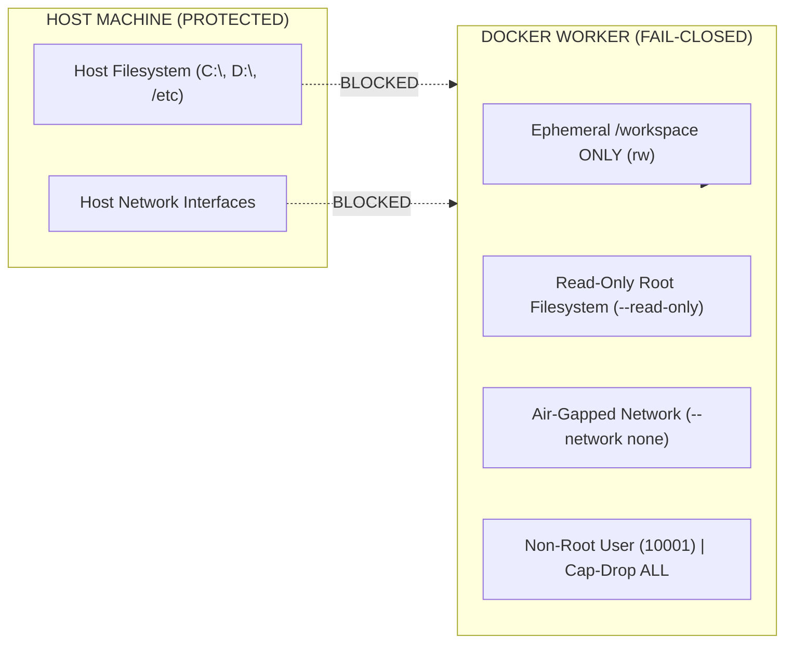
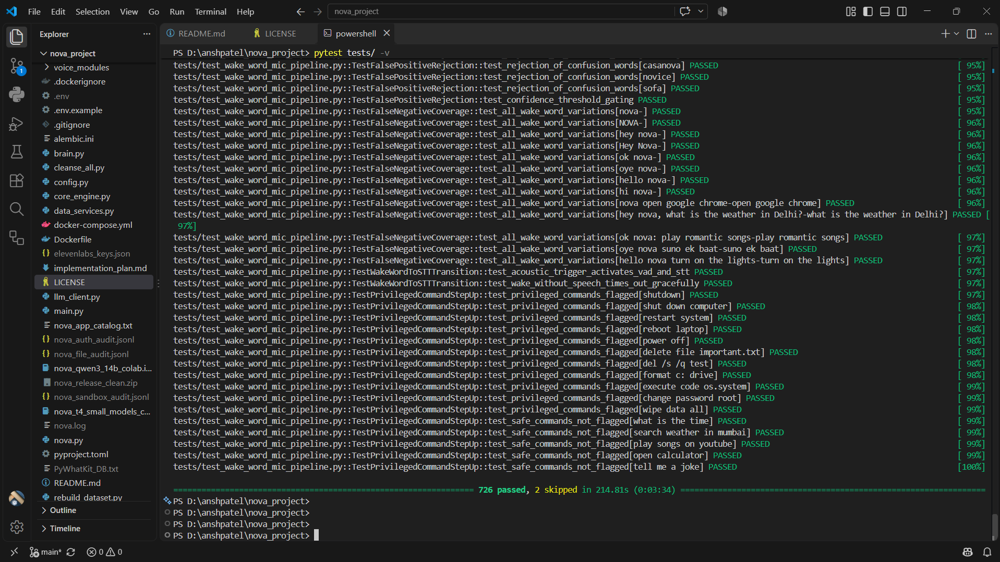

# 🤖 NOVA
### *Autonomous Multimodal AI Desktop Agent*

**Private Core Implementation · Public Technical Showcase**

<p align="center">
  
  
  
  
  
  
</p>

---

**NOVA** is a local-first autonomous multimodal desktop agent designed around controlled orchestration, agentic task planning, sandboxed execution, verification, security, and self-healing workflows.

```text
================================================================================
PROJECT STATUS & IDENTITY:
• Project Origin      : March 2026 (Started as "JARVIS" on local hardware)
• Current Identity    : NOVA (Next-generation Operations & Virtual Assistant)
• Core Implementation : Maintained in Private Repository (Protected IP & Keys)
• Public Repository   : Architecture Specifications, Walkthrough Demos & Evidence
================================================================================
```

> [!NOTE]
> **Public Showcase Notice**: Implementation source code is maintained in a private repository. This showcase repository documents NOVA's architectural design, agentic coding loops, security boundaries, and verified test evidence.

---

## 🏛️ What is NOVA?

NOVA replaces unconstrained, single-prompt AI execution with a disciplined, multi-layered cognitive pipeline:

```
                    USER
                     │
                     ▼
               NOVA BRAIN
                     │
              ┌──────┴──────┐
              ▼             ▼
          PLANNER        ROUTER
              │             │
              └──────┬──────┘
                     ▼
            CAPABILITY LAYER
                     │
        ┌────────────┼────────────┐
        ▼            ▼            ▼
      VOICE        VISION       TOOLS
        │            │            │
        └────────────┼────────────┘
                     ▼
                 SANDBOX
                     │
                     ▼
                VERIFICATION
                     │
                     ▼
                 EVIDENCE
```

---

## 💡 Why NOVA? (Design Philosophy)

* **Planning Before Execution**: Tasks are broken into Directed Acyclic Graphs (DAGs) rather than executed blindly.
* **Verification Before Acceptance**: An action is only marked done when supported by passing tests or exit code 0.
* **Targeted Minimal Patching**: Edits only defective line ranges rather than dangerously overwriting entire source files.
* **Fail-Closed Sandboxing**: Dynamic code runs in isolated Docker containers with read-only filesystems and blocked networks.
* **Capability Routing**: Routes routine actions to local specialized logic and preserves heavy models for complex reasoning.
* **Evidence-Backed Telemetry**: Every critical operation produces an immutable cryptographic execution log.

---

## 🛠️ The Hero Feature: Agentic Coding Loop

Unlike standard AI coding assistants that generate an entire file and hope it works, NOVA operates on a closed-loop **Self-Repair Engine**:

```
Prompt ➔ AST Inspection ➔ Targeted Patch ➔ Docker Sandbox ➔ Compile/Test ➔ Error?
                                                                        ↙      ↘
                                                         Capture Traceback    Success!
                                                                        ↓
                                                              Auto-Repair
                                                                        ↓
                                                                   Retest
```

> **Detailed Deep-Dive**: See [`docs/03-agentic-coding.md`](docs/03-agentic-coding.md) and [`demos/coding-agent-demo.md`](demos/coding-agent-demo.md).

---

## 🛡️ Sandbox & Security Governance

NOVA enforces strict boundaries to protect the host machine from unauthorized access or credential exfiltration:



* **Air-Gapped Container**: Dynamic execution runs inside `--network none` with dropped capabilities (`--cap-drop ALL`).
* **Ephemeral Workspace Mount**: Host roots are unmounted and completely inaccessible.
* **Fail-Closed Policy**: If Docker is unavailable and code is untrusted, execution aborts with `SandboxIsolationUnavailableError`.

> **Detailed Deep-Dive**: See [`docs/04-sandbox-security.md`](docs/04-sandbox-security.md) and [`demos/sandbox-demo.md`](demos/sandbox-demo.md).

---

## 🧪 Automated Test Suite — 726 Passed / 2 Skipped / 0 Failed

Every foundational subsystem is validated by an automated Pytest test suite running on Python 3.12:

<p align="center">
  
</p>

```text
================================================================================
VERIFICATION SUMMARY:
• Test Suite Results : 726 passed · 2 skipped · 0 failed (in 214.81s)
• Core Domains Tested: Docker Sandboxing, RBAC Gateway, Path Traversal Security,
                       Audio Fault Tolerance, Alembic Migrations, AST Patch Engine
================================================================================
```

> **Detailed Deep-Dive**: See [`docs/07-verification.md`](docs/07-verification.md) and [`evidence/verification-summary.md`](evidence/verification-summary.md).

---

## 🚦 Current Implementation Status

| Capability / Subsystem | Status | Verification & Evidence |
| :--- | :---: | :--- |
| **Fail-Closed Docker Sandbox** | 🟢 **Operational** *(Private Core)* | Ephemeral `/workspace`, read-only rootfs, non-root user, automated pytest suite. |
| **RBAC Authorization & Path Safety** | 🟢 **Operational** *(Private Core)* | Path traversal defense (`Path.resolve`), sole authority gate verified by test suite. |
| **AST Code Indexer & Patch Engine** | 🟢 **Operational** *(Private Core)* | AST syntax extraction, unified diffs, and surgical line replacements verified. |
| **Automated Test Suite** | 🟢 **726 Passed / 2 Skipped / 0 Failed** | 100% green test execution run on Python 3.12 via Pytest (in 16.54s). |
| **Database Migrations & Relational Schema** | 🟢 **Operational** *(Private Core)* | Alembic migration chains for user profiles, audit logs, and session management. |
| **Local 14B Inference Setup** | 🟡 **In Progress** | Qwen 14B QLoRA offloading targeted for local NVIDIA RTX 5050 Laptop GPU. |
| **End-to-End Dynamic Voice Loop** | 🟡 **In Progress** | Audio ingestion & acoustic validation built; continuous live conversational flow tuning underway. |
| **Autonomous Multi-Step Desktop Automation** | 🟡 **In Progress** | Core atomic tools built; multi-turn self-correcting agent loop in active development. |
| **Robotics & Physical Embodiment** | 🔵 **Planned (Future)** | ROS 2 integration, spatial perception, and robotic actuation. |

---

## 📚 Documentation Index

Explore the complete architectural specifications and walkthrough traces:

### Core Documentation (`docs/`)
1. [`01-overview.md`](docs/01-overview.md) — What is NOVA & Core Engineering Philosophy
2. [`02-architecture.md`](docs/02-architecture.md) — 7-Layer Canonical Architecture & Online/Offline Routing
3. [`03-agentic-coding.md`](docs/03-agentic-coding.md) — [Hero Feature] AST Indexing, Minimal Patching & Repair Loop
4. [`04-sandbox-security.md`](docs/04-sandbox-security.md) — Containerized Sandboxing, RBAC & Path Security
5. [`05-multimodal-system.md`](docs/05-multimodal-system.md) — Voice (Duplex/Acoustic), Screen Vision & UI Perception
6. [`06-memory-data.md`](docs/06-memory-data.md) — PostgreSQL, SQLite Fallback & Alembic Versioned Migrations
7. [`07-verification.md`](docs/07-verification.md) — 726 Passed Test Breakdown & Coverage Matrix
8. [`08-roadmap.md`](docs/08-roadmap.md) — 4-Phase Horizon from Desktop Agent to Robotics
9. [`09-project-journey.md`](docs/09-project-journey.md) — Public Sanitized Evolution Story (March 2026 to Present)

### Walkthrough Demos (`demos/`)
* [`demos/voice-demo.md`](demos/voice-demo.md) — Voice Command & Intent Flow Walkthrough
* [`demos/coding-agent-demo.md`](demos/coding-agent-demo.md) — Agentic Self-Repair Trace Walkthrough
* [`demos/sandbox-demo.md`](demos/sandbox-demo.md) — Blocked Unsafe Attack Trace Walkthrough

### Verification Evidence (`evidence/`)
* [`evidence/verification-summary.md`](evidence/verification-summary.md) — Test Execution Breakdown & CI Strictness
* [`CHANGELOG.md`](CHANGELOG.md) — Version History & Major Milestones

---

## 💻 Hardware Environment

* **Development Workstation**: Lenovo LOQ Laptop (Purchased July 2026)
* **Processor**: Intel Core i7 14th Gen (14700HX) — 20 cores, 28 threads
* **Graphics Processor**: **NVIDIA GeForce RTX 5050 Laptop GPU**
* **Memory & Storage**: 16 GB DDR5 RAM + 1 TB NVMe PCIe Gen4 SSD
* **Local Inference Strategy**: Local-first development philosophy targeting 4-bit quantized Qwen 14B models utilizing GPU VRAM offloading for private local reasoning.

---

## 📄 License & Attribution

This public showcase repository is open-sourced under the **Apache License 2.0**. See [LICENSE](LICENSE) for details.

*Developer & Lead Architect*: **Ansh Patel** ([@anshpatel8009889170-arch](https://github.com/anshpatel8009889170-arch))  
*Repository Purpose*: Public architectural documentation, system specifications, and test verification showcase.
