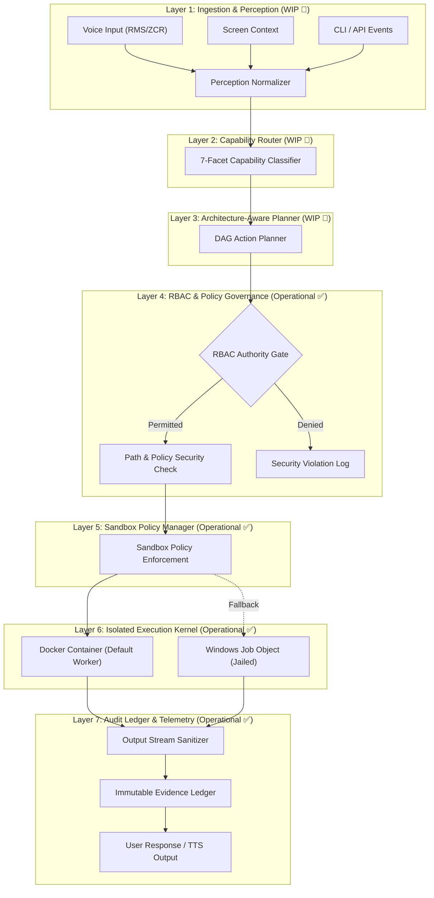

# 🏛️ 02. System Architecture & Routing

NOVA operates on a **7-Layer Canonical Architecture** coupled with an intelligent **Online vs. Offline Capability Router**.

---

## 1. The 7-Layer Canonical Architecture

Every user stimulus—whether received via voice, screen context, or CLI—flows through seven distinct architectural boundaries:



### Layer Responsibilities:
1. **Layer 1 (Ingestion)**: Handles acoustic signal normalization, continuous listening states, and screen capture frames.
2. **Layer 2 (Capability Router)**: Classifies requests across 7 dimensions (Automation, Files, Search, Code, Messaging, Biometrics, Memory).
3. **Layer 3 (Planner)**: Decomposes tasks into atomic action graphs and resolves required tool dependencies.
4. **Layer 4 (RBAC & Policy)**: Sole authority gate validating permissions and preventing directory traversal escapes (`Path.resolve`).
5. **Layer 5 (Sandbox Policy)**: Builds immutable execution parameters (memory limits, timeout, network lockdown).
6. **Layer 6 (Execution Kernel)**: Runs worker containers with non-root privileges and dropped Linux capabilities.
7. **Layer 7 (Audit & Telemetry)**: Cleanses output streams of credentials and commits immutable execution records.

---

## 2. Online vs. Offline Routing Architecture

A core identity of NOVA is its **Dual-Brain Hybrid Topology**. It does not assume an internet connection is always needed or that all reasoning must leave the machine:

```
                         NOVA BRAIN
                             │
                      Capability Router
                       /             \
                      /               \
                ONLINE                 OFFLINE
                   │                      │
           External Cloud LLMs       Local Neural Models
           • Deep Code Refactor      • Sub-second Tool Dispatch
           • Heavy Research          • Local Memory Query
           • Abstract Reasoning      • System Controls & Media
```

| Dimension | Offline Brain (Local) | Online Brain (Cloud Relay) |
| :--- | :--- | :--- |
| **Model Target** | Fine-Tuned Qwen 14B QLoRA (`.gguf`) | Frontier LLMs (Claude 3.5 Sonnet / GPT-4o) |
| **Hardware** | NVIDIA GeForce RTX 5050 Laptop GPU | External Secure HTTPS API Relay |
| **Target Latency** | $\sim 20\text{--}40\text{ ms}$ (Local Token Inference) | $\sim 600\text{--}1200\text{ ms}$ (Network Dependent) |
| **Privacy Guarantee** | 100% Local Workstation Privacy | Ephemeral, End-to-End Encrypted Relay |
| **Availability** | Works completely offline | Optional, enabled on-demand |

---

[Next: 03. Agentic Coding & Self-Repair ➔](03-agentic-coding.md)
