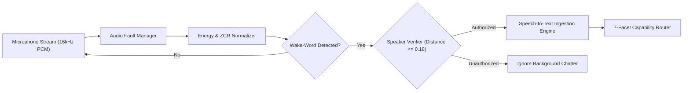

# 🎙️ 05. Multimodal System & Desktop Perception

NOVA integrates voice, audio processing, and screen perception into a unified sensory subsystem designed for hands-free desktop interaction.

---

## 1. Subsystem Maturity Classification

To maintain absolute architectural transparency, multimodal features are categorized by their current operational state:

| Multimodal Capability | Architectural Status | Operational Mechanism |
| :--- | :---: | :--- |
| **Wake-Word Ingestion** | 🟢 **Operational** | Continuous 16kHz PCM stream energy monitoring via RMS sliding windows. |
| **Audio Fault Tolerance** | 🟢 **Operational** | Automatic device re-enumeration and buffer recovery on microphone dropouts. |
| **Acoustic Feature Extraction** | 🟢 **Operational** | RMS energy, Zero-Crossing Rate (ZCR), and spectral centroid validation. |
| **Biometric Speaker Verification** | 🟡 **Experimental** | Euclidean and Cosine distance validation against enrolled voice templates ($\le 0.18$). |
| **Full-Duplex Interruption** | 🟡 **Development** | Dynamic playback suppression upon detecting immediate user speech override. |
| **Screen Context Capture** | 🟡 **Development** | Multi-monitor surface frame grabber for window-specific OCR and visual bounding boxes. |
| **Autonomous Multi-App Vision** | 🔵 **Planned** | Real-time multi-frame visual agent navigating dynamic graphical interfaces. |

---

## 2. Voice Pipeline Architecture

### Key Engineering Safeguards:
1. **Dynamic Noise Suppression**: Ambient background noise is continuously tracked, preventing false positive triggers from keyboard typing or room echoes.
2. **Audio Hardware Fault Tolerance (`audio/audio_fault_manager.py`)**: If the primary microphone is disconnected or throttles, the fault manager gracefully catches stream exceptions and attempts automatic re-initialization without crashing the core engine.
3. **Biometric Gating**: Executive desktop actions (such as closing apps, modifying system settings, or deleting files) require confirmed speaker identity before execution.

---

## 3. Screen Vision & OCR Architecture

* **Target Surface Ingestion**: Zero-copy surface capture targeting active window handles or complete multi-monitor coordinate spaces.
* **Focused ROI Cropping**: Extracts regions of interest (e.g. terminal windows, browser text, error dialogues) to minimize visual reasoning tokens.
* **Privacy Field Masking**: Automated detection and blurring of password prompts, auth tokens, and sensitive credential fields prior to image dispatch.

---

[Next: 06. Memory & Data Infrastructure ➔](06-memory-data.md)
