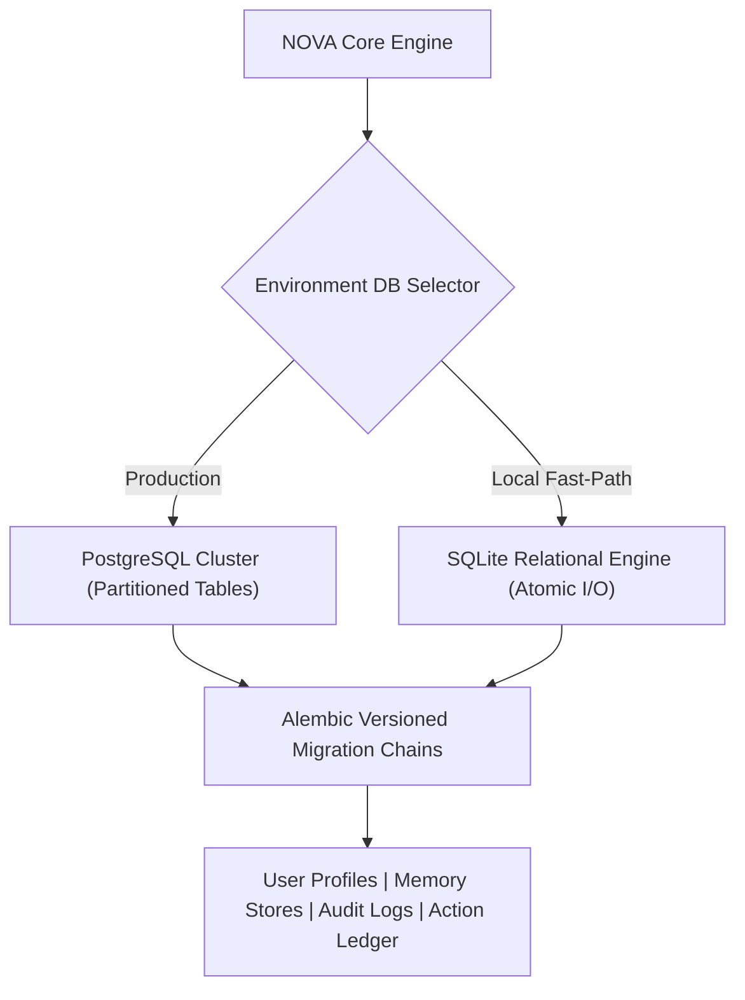

# 🗄️ 06. Memory & Data Infrastructure

NOVA incorporates a dual-tier persistence layer and structured data pipelines to support long-term context retention and model training workflows.

---

## 1. Dual-Tier Persistence Architecture

### 1. Production PostgreSQL Layer
* Enterprise relational backend featuring table partitioning for audit ledgers and high-frequency sensor streams.
* Handles long-term semantic context, historical execution logs, and multi-session telemetry.

### 2. SQLite Local Fast-Path Layer
* Zero-configuration relational fallback for offline and lightweight desktop deployment.
* Employs atomic write operations (`utils/atomic_io.py`) and Write-Ahead Logging (WAL) to ensure ACID compliance during unexpected power loss.

---

## 2. Versioned Schema Migrations (`migrations/`)

Database structures in NOVA are strictly managed through **Alembic** migration scripts:
* Every schema modification (tables, indexes, foreign keys, partition ranges) is committed as a forward (`upgrade()`) and backward (`downgrade()`) migration version.
* Automated CI test suites (`test_personality_llm_memory_and_migrations.py`) verify migration chains against clean test databases before any code merges.

---

## 3. Dataset Generation & QLoRA Fine-Tuning Pipeline

To train the local **Qwen 14B** model for specialized desktop routing:
1. **Canonical Dataset Extraction (`scripts/export_dataset.py`)**: Exports sanitized conversation turns and tool invocation pairs into JSONL datasets.
2. **Deduplication & Schema Contracts**: Sanitizes outputs and verifies that training records adhere to strict input/output contract schemas.
3. **Cloud GPU QLoRA Training (`train_nova_qlora_14b.py`)**: Fine-tunes low-rank adaptation weights (LoRA rank=16, alpha=32) on remote Google Colab GPUs (T4/A100), ensuring zero local thermal load during training.

---

[Next: 07. Verification & Testing Proof ➔](07-verification.md)
