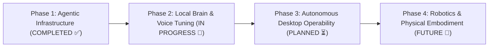

# 🗺️ 08. Project Roadmap & Future Evolution

NOVA follows a structured, multi-phase engineering trajectory designed to scale from local desktop assistance to physical embodied intelligence.

---

## The 4-Phase Engineering Horizon

---

### Phase 1: Core Agentic Infrastructure (Completed & Verified ✅)
* **Milestone**: Establish battle-tested software foundations before adding complex neural models.
* **Deliverables**:
  - 7-Layer Canonical Architecture with clear operational boundaries.
  - Fail-closed Docker sandboxing and Windows Job Object fallback.
  - Role-Based Access Control (RBAC) and path traversal security shields.
  - AST-based code indexing and surgical patching engine.
  - **726 automated unit and integration tests passing at 100% green**.

### Phase 2: Local Brain Fine-Tuning & Voice State Tuning (In Progress 🚧)
* **Milestone**: Optimize local inference and hands-free conversational loops.
* **Deliverables**:
  - Quantized Qwen 14B QLoRA adapter fine-tuning for desktop capability routing.
  - Real-time continuous listening state machine with full-duplex interruption.
  - Offloading attention layers to local NVIDIA GeForce RTX 5050 Laptop GPU.
  - Benchmarking sub-second tool dispatch latency.

### Phase 3: Autonomous Multi-App Desktop Operability (Planned ⏳)
* **Milestone**: Empower NOVA to execute complex, multi-application workflows autonomously.
* **Deliverables**:
  - Dynamic visual UI grounding (OCR + spatial element detection).
  - Multi-turn self-correcting agentic loops navigating browsers, IDEs, and system utilities.
  - Long-term associative memory retrieval across days and weeks of user tasks.

### Phase 4: Robotics Integration & Embodied Intelligence (Future Vision 🔭)
* **Milestone**: Transition NOVA's cognitive brain from virtual software to physical hardware.
* **Deliverables**:
  - Integration with Robot Operating System 2 (ROS 2).
  - Spatial visual perception for robotic arm manipulation and embedded microcontrollers.
  - Real-time sensor fusion combining acoustic, visual, and environmental telemetries.

---

> [!IMPORTANT]
> **Roadmap Integrity**: Features in Phase 2, 3, and 4 represent architectural objectives and active engineering plans. They are strictly differentiated from Phase 1 components that have already been implemented and verified.

---

[Next: 09. Project Journey ➔](09-project-journey.md)
