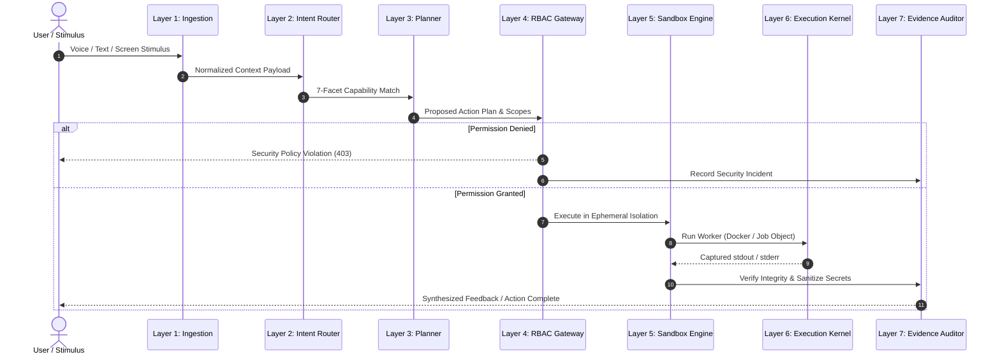

# 🏛️ NOVA Architecture & Canonical Pipeline Specification

This document details the architectural principles and operational pipeline of **NOVA (Next-generation Operations & Virtual Assistant)**.

---

## 1. Design Philosophy

NOVA is architected around four core design principles:
1. **Local Privacy by Default**: Zero user prompts or voice data are transmitted to external clouds without explicit user consent.
2. **Fail-Closed Security**: If any security barrier (sandbox, authorization, path policy) cannot be verified, execution fails closed and aborts rather than degrading gracefully into an insecure state.
3. **Immutable Evidence Trail**: Every intent, decision, execution result, and verification hash is preserved in an audit ledger.
4. **Resilient Self-Healing**: Subsystems feature automated fault tolerance, adaptive retry policies, and automated repair triggers.

---

## 2. The 7-Layer Canonical Pipeline

### Layer Breakdown:

### Layer 1: Perception & Ingestion
* **Continuous Audio Monitoring**: High-frequency RMS energy and Zero-Crossing Rate (ZCR) feature extraction for sub-second wake-word detection.
* **Acoustic Speaker Verification**: Voice biometric validation ensuring only authorized voices trigger executive system actions.
* **Visual Screen Capture**: Real-time multi-monitor frame ingestion for desktop UI context understanding.

### Layer 2: Capability Router (7-Facet)
* Evaluates input against 7 canonical capability dimensions:
  1. System Automation & Power Management
  2. Local File & Workspace Operations
  3. Web Browsing & Information Retrieval
  4. Code Analysis, Generation & Testing
  5. Communication & Messaging (WhatsApp, Email)
  6. Biometrics & Identity Management
  7. Long-Term Memory & Context Recall

### Layer 3: Architecture-Aware Planner
* Deconstructs multi-step user tasks into a Directed Acyclic Graph (DAG) of atomic operations.
* Validates dependencies and tool manifests before initiating execution.

### Layer 4: RBAC & Authority Gateway
* Sole authority gate for all system mutations.
* Constant-time token verification (`secrets.compare_digest`).
* Path traversal defense with cross-platform canonicalization (`Path.resolve()` boundary checks).

### Layer 5: Sandbox Policy Manager
* Constructs `SandboxPolicy` objects defining:
  - Ephemeral workspace path
  - Read-only root filesystem
  - Network isolation state
  - Memory limit (e.g. 512MB)
  - CPU quota (e.g. 1.0 core)
  - Process tree kill deadlines

### Layer 6: Execution Kernel
* Delegates execution to the isolated container worker.
* Captures real-time output streams with timeout enforcement.

### Layer 7: Evidence Auditor & Sanitizer
* Strips credentials, API tokens, and sensitive system paths from all outputs.
* Records immutable execution evidence to audit matrix.

---

## 3. Dual-Brain Cognitive Architecture

| Brain Component | Primary Model | Latency | Execution Environment |
| :--- | :--- | :--- | :--- |
| **Fast-Path Instinct** | Fine-Tuned Qwen 14B QLoRA | $20\text{--}40\text{ ms}$ | Local RTX 5050 Laptop GPU |
| **Heavy Analytical Reasoner** | Cloud LLM Gateway (Claude 3.5 Sonnet / GPT-4o) | $600\text{--}1200\text{ ms}$ | Encrypted HTTPS API Relay |

Fast-path reasoning handles 90% of desktop automation, media control, local queries, and security decisions locally with zero internet latency. Complex multi-file refactoring or broad research seamlessly delegates to the heavy analytical reasoner when requested.
