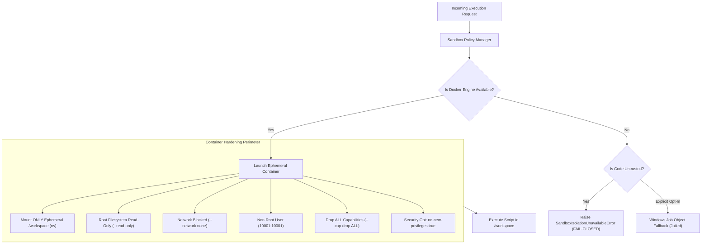

# 🛡️ NOVA Security Sandbox & Isolation Specification

This document details the containerized sandboxing engine, fail-closed boundaries, and process jailing mechanisms implemented within **NOVA**.

---

## 1. Threat Model & Sandboxing Objectives

When an autonomous desktop AI assistant generates and executes code, it encounters severe security threats:
* **Arbitrary Code Execution**: Untrusted scripts attempting to access host root filesystems (`C:\`, `C:\Users`, `/etc`).
* **Credential Exfiltration**: Malicious code attempting to harvest `.env` files, browser cookies, SSH keys, or API tokens.
* **Network Escapes**: Reverse shells or unauthorized socket outbound connections.
* **Resource Exhaustion**: Fork bombs, runaway infinite loops, and GPU memory saturation.

To eliminate these vectors, NOVA enforces a **Fail-Closed Containerized Sandbox Architecture**.

---

## 2. Docker-by-Default Architecture

---

## 3. Container Hardening Parameters

Every Docker container launched by NOVA is instantiated with the following mandatory runtime flags:

| Flag | Security Rationale |
| :--- | :--- |
| `-v <temp_ws>:/workspace:rw` | **Strict Filesystem Isolation**: Only the job-specific scratch workspace is mounted. Host drives (`C:\`, `D:\`) are invisible. |
| `--read-only` | **Immutable Rootfs**: Prevents modifications to system binaries, python site-packages, or `/tmp`. |
| `--network none` | **Air-Gapped Execution**: Blocks all socket connections, data exfiltration, and reverse shells. |
| `--user 10001:10001` | **Non-Root Execution**: Prevents container privilege escalation. |
| `--cap-drop ALL` | **Dropped Linux Capabilities**: Strips `CAP_SYS_ADMIN`, `CAP_NET_RAW`, etc. |
| `--security-opt no-new-privileges:true` | **No SUID Escalation**: Prevents binaries from gaining elevated permissions. |
| `--memory=512m` | **Memory Quota**: Hard cap to prevent host memory starvation. |
| `--cpus=1.0` | **CPU Quota**: Prevents CPU throttling of host system processes. |
| `--pids-limit=64` | **PID Cap**: Immune to fork bombs. |

---

## 4. Fallback Architecture: Windows Job Object Manager

In local development environments where Docker is not running and execution is explicitly permitted by an administrator, NOVA falls back to a kernel-level **Windows Job Object Sandbox**:

1. **Process Tree Termination**: When the configured timeout expires (default: 15s), the Job Object terminates the entire process tree simultaneously, guaranteeing zero orphaned processes.
2. **Socket Neutralization**: Intercepts and blocks unauthorized socket bindings.
3. **Strict Path Boundary Verification**: Canonicalizes all targets against `Path.resolve()` to prevent directory traversal (`../../`) attacks.
4. **Environment Credential Scrubbing**: Strips all system environment variables containing `KEY`, `TOKEN`, `SECRET`, `PASSWORD`, or `AUTH` before launching the child process.
